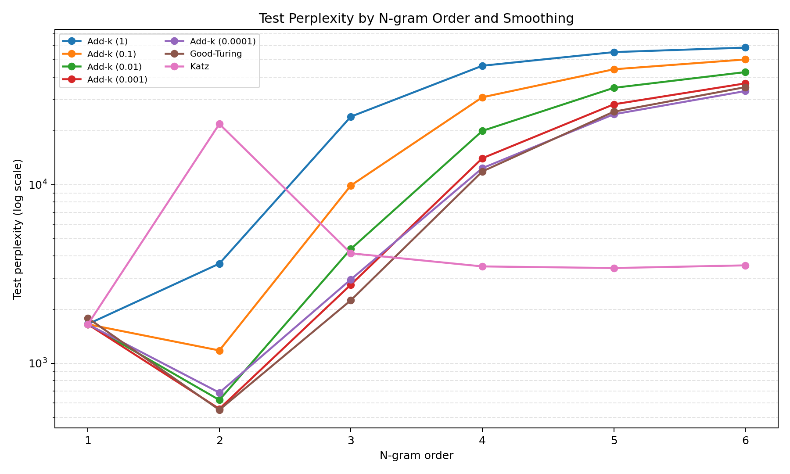
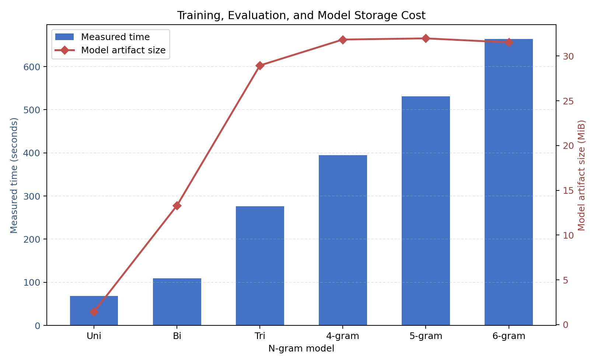

# 中文 n-gram 语言模型实验报告

> GitHub 仓库链接占位符：<https://github.com/OWNER/REPOSITORY>。创建仓库后请替换为实际地址。

## 摘要

本实验使用本地 PFR《人民日报》1998 年 1—6 月分词语料，按文章划分训练、验证和测试集，在 unigram 至 6-gram 上比较五个 add-k 参数、Good-Turing 与 Katz 平滑。候选平滑只按验证集交叉熵选择；测试集用于最终评分。2-gram 选择 Good-Turing，测试困惑度最低，为 549.551；4—6-gram 选择 Katz，但其困惑度仍高于 2-gram。所有候选完整指标见 [`model_comparison.csv`](../metrics/model_comparison.csv)。

## 1. 语料来源、内容与清洗

### 1.1 来源与内容

工作区中的 `data/raw/199801.txt`—`199806.txt` 为中文新闻语料，已分词并带词性标注，记录内容包括新闻正文、标题、标点、数字、日期、专名、署名及来源文字。随附的 `data/raw/shengming.doc` 将语料说明为 PFR《人民日报》标注语料库 1.0，并记载其制作机构及使用时的来源注明要求。该说明同时提及当时公开发布的是 1 月语料；因此本报告只记录工作区实际使用了六个月份文件，不据此推断其余月份的再分发授权。对外发布前应核实各文件适用的授权条件。

六个输入文件均按 UTF-8 with BOM（`utf-8-sig`）读取；清洗结果统一写成 UTF-8 JSONL。清洗程序按 `日期-版面-文章-段落/m` 解析边界，并以“日期-版面-文章”作为文章 ID。

### 1.2 清洗规则及统计

- 移除段落编号及其 `/m` 标记、词性标签；组合标注去除方括号和外围类别标签，保留括号内的词序。
- 保留正文词语、标点、数字、日期、署名和来源文字；不做未经记录的词形或全半角规范化。
- 每个段落写成一个 JSONL 记录，并保留来源文件、文章 ID、段落 ID 和 token 数组；段落之间不合并。
- 空行用于边界识别，不作为正文；异常标注计数并留样。清洗阶段不映射未知词，未知词映射仅在训练词表及评估阶段处理。

| 清洗统计 | 数值 |
|---|---:|
| 原始文件数 | 6 |
| 文章数 | 18,647 |
| 段落数 | 123,882 |
| 清洗后 token 数 | 7,286,875 |
| 空段落数 | 0 |
| 无法解析的行 | 0 |
| 标注异常数 | 1 |

唯一标注异常位于 `199805.txt`，样例包含空词项 `/m`；程序保留异常计数和样例，不将该问题静默忽略。未发现无法解析的语料行。

## 2. 文章、段落与数据集划分

划分器按文章 token 内容摘要把重复文章合并为不可拆分组；以种子 42 打乱后按组大小降序排列，再贪心分配至最接近各月份 8:1:1 目标比例的集合。该方式保证重复文章组同集合，但不是逐月独立随机打乱后按整数取整。清单记录 9 组、共 55 篇重复文章，以及 3 个重复段落编号；划分以文章 ID 为单位，集合之间不共享文章，实际分配数如下表。

| 月份 | Train 文章 | Validation 文章 | Test 文章 |
|---|---:|---:|---:|
| 199801 | 2,518 | 315 | 315 |
| 199802 | 2,100 | 263 | 263 |
| 199803 | 2,324 | 291 | 290 |
| 199804 | 2,772 | 346 | 347 |
| 199805 | 2,579 | 322 | 322 |
| 199806 | 2,624 | 328 | 328 |
| **合计** | **14,917** | **1,865** | **1,865** |

训练、验证、测试的段落数分别为 98,511、12,519、12,852；正文 token 数分别为 5,774,785、734,379、777,711。加上每段预测的 `</s>`，各集合评估事件数分别为 5,873,296、746,898、790,563。边界处理以段落为序列单位：每段开头补充 `<s>` 上下文，段尾的 `</s>` 作为预测目标，不跨段拼接 n-gram。

词表仅由训练集建立：保留训练频次至少为 2 的普通词，较低频训练词及验证/测试 OOV 映射为 `<UNK>`。本次词表（含 `<UNK>`、`</s>`）大小为 70,734；`<s>` 只作上下文，不作预测目标。

## 3. 技术原理与实验实现

### 3.1 n-gram 与评估指标

给定历史上下文 `h` 和目标词 `w`，未平滑 n-gram 最大似然估计为：

$$P(w\mid h)=\frac{C(h,w)}{C(h)}$$

当 `n=1` 时，上下文为空。对整个评估集合，负对数似然为 `NLL = -Σ log P(w|h)`，平均交叉熵为 `H = NLL/M`，困惑度为 `PP = exp(H)`；本实现使用自然对数，`M` 统计正文目标 token 与每段的 `</s>`，不统计 `<s>`。困惑度越低，表示模型在该评估 token 流上的平均预测不确定性越低。若 MLE 存在零概率事件，则完整序列的 NLL/交叉熵/困惑度不定义，本报告改报零概率数、零概率率和覆盖率，不用非零子集上的分数代替。

### 3.2 平滑候选

每个阶数分别评估 7 个平滑候选：

1. **加-k（add-k）**：`P_k(w|h) = (C(h,w)+k)/(C(h)+k|V_pred|)`，本次 `k ∈ {1, 0.1, 0.01, 0.001, 0.0001}`。`V_pred` 包含训练词表、`<UNK>` 和 `</s>`，不含 `<s>`。
2. **Good-Turing**：由 count-of-counts `N_r` 估计调整计数 `r*=(r+1)N_{r+1}/N_r`，count-of-counts 在当前阶数的全体已观测 n-gram 上统计。实现对缺少后继频次的计数使用基于单例/双例数量的回退折扣（两者均为零时取 0.5），并将调整计数限制在原始计数范围内；对已观测上下文的未见续接词，将剩余概率质量均分。剩余质量设有 `1e-12` 下限；评估中遇到训练集未出现的整个上下文时，使用 `1/(|V_pred| × 该阶训练事件数)` 的小概率回退。这些是本项目实现细节，不代表所有 Good-Turing 变体。
3. **Katz 回退**：已见 n-gram 使用 count-of-counts 折扣；未见 n-gram 回退到低阶分布，并以 `α(h)` 分配剩余质量。最低阶 unigram 基底使用 add-k `k=0.01`；频次折扣缺少后继频数时采用 0.5 回退值。若递归回退结果不为正，评估代码以 `1/(|V_pred| × 该阶训练事件数)` 作为概率下限。此处报告的是当前代码实现的 Katz 回退配置，不将其泛化为所有 Katz 变体。

每阶按**验证集交叉熵最低**选择一个平滑候选，再对所有候选计算独立测试指标。测试集结果不用于选择。每阶只保留一个词表/计数模型目录；模型元数据标明获选平滑方法和参数，所有候选指标统一保存在 JSON 与 CSV 中。

## 4. 原始实验结果

### 4.1 各平滑候选的验证交叉熵和测试困惑度

以下保留每阶 7 个候选的核心原始指标；更完整的 NLL、事件数、未知词率、零概率率、覆盖率、耗时和模型大小见 [`model_comparison.csv`](../metrics/model_comparison.csv)。星号表示按验证集交叉熵选中的候选。交叉熵单位为 nat/预测事件（包含正文 token 与段尾 `</s>`），困惑度使用相同事件计数口径。

| n | 候选方法 | Validation CE | Test perplexity | 选中 |
|---:|---|---:|---:|:---:|
| 1 | add-k (1) | 7.4420 | 1,659.2377 |  |
| 1 | add-k (0.1) | 7.4398 | 1,655.1197 |  |
| 1 | add-k (0.01) | 7.4396 | 1,654.8259 |  |
| 1 | add-k (0.001) | 7.4396 | 1,654.7979 |  |
| 1 | add-k (0.0001) | 7.4396 | 1,654.7952 | ★ |
| 1 | Good-Turing | 7.5201 | 1,793.2403 |  |
| 1 | Katz | 7.4396 | 1,654.8259 |  |
| 2 | add-k (1) | 8.2261 | 3,618.1941 |  |
| 2 | add-k (0.1) | 7.1187 | 1,181.5579 |  |
| 2 | add-k (0.01) | 6.4883 | 624.0470 |  |
| 2 | add-k (0.001) | 6.3811 | 556.7400 |  |
| 2 | add-k (0.0001) | 6.6000 | 685.7483 |  |
| 2 | Good-Turing | 6.3593 | 549.5513 | ★ |
| 2 | Katz | 9.9714 | 21,886.3450 |  |
| 3 | add-k (1) | 10.1106 | 24,054.3119 |  |
| 3 | add-k (0.1) | 9.2464 | 9,902.2831 |  |
| 3 | add-k (0.01) | 8.4534 | 4,370.6324 |  |
| 3 | add-k (0.001) | 8.0130 | 2,758.1036 |  |
| 3 | add-k (0.0001) | 8.0933 | 2,950.1464 |  |
| 3 | Good-Turing | 7.8182 | 2,255.7116 | ★ |
| 3 | Katz | 8.3756 | 4,132.3662 |  |
| 4 | add-k (1) | 10.7548 | 46,344.4263 |  |
| 4 | add-k (0.1) | 10.3698 | 30,874.4247 |  |
| 4 | add-k (0.01) | 9.9617 | 20,016.8040 |  |
| 4 | add-k (0.001) | 9.6334 | 14,070.5505 |  |
| 4 | add-k (0.0001) | 9.5241 | 12,380.8102 |  |
| 4 | Good-Turing | 9.4811 | 11,869.3404 |  |
| 4 | Katz | 8.2377 | 3,490.3812 | ★ |
| 5 | add-k (1) | 10.9265 | 55,252.8337 |  |
| 5 | add-k (0.1) | 10.7235 | 44,278.9262 |  |
| 5 | add-k (0.01) | 10.5073 | 34,855.1560 |  |
| 5 | add-k (0.001) | 10.3186 | 28,187.1302 |  |
| 5 | add-k (0.0001) | 10.2115 | 24,794.5419 |  |
| 5 | Good-Turing | 10.2410 | 25,634.4714 |  |
| 5 | Katz | 8.2245 | 3,417.3118 | ★ |
| 6 | add-k (1) | 10.9840 | 58,552.2880 |  |
| 6 | add-k (0.1) | 10.8492 | 50,256.8392 |  |
| 6 | add-k (0.01) | 10.7091 | 42,700.6931 |  |
| 6 | add-k (0.001) | 10.5874 | 36,923.2609 |  |
| 6 | add-k (0.0001) | 10.5104 | 33,442.4185 |  |
| 6 | Good-Turing | 10.5541 | 35,169.3527 |  |
| 6 | Katz | 8.2633 | 3,537.8565 | ★ |

### 4.2 最终获选候选的详细指标

| n | 获选候选 | Validation CE | Test CE | Test perplexity | Test events | Test OOV rate | Test zero-probability events | 非零概率覆盖率 |
|---:|---|---:|---:|---:|---:|---:|---:|---:|
| 1 | add-k, k=0.0001 | 7.4396 | 7.4114 | 1,654.7952 | 790,563 | 1.969% | 0 | 100% |
| 2 | Good-Turing | 6.3593 | 6.3091 | 549.5513 | 790,563 | 1.969% | 0 | 100% |
| 3 | Good-Turing | 7.8182 | 7.7212 | 2,255.7116 | 790,563 | 1.969% | 0 | 100% |
| 4 | Katz | 8.2377 | 8.1578 | 3,490.3812 | 790,563 | 1.969% | 0 | 100% |
| 5 | Katz | 8.2245 | 8.1366 | 3,417.3118 | 790,563 | 1.969% | 0 | 100% |
| 6 | Katz | 8.2633 | 8.1713 | 3,537.8565 | 790,563 | 1.969% | 0 | 100% |

测试集共有 777,711 个正文 token 和 12,852 个段尾预测事件；其中 15,313 个正文 token 映射为 `<UNK>`。表中“非零概率覆盖率”对应原始 JSON/CSV 字段 `ngram_coverage`，代码将其定义为非零概率事件比例；平滑模型给未见事件分配非零概率，因此该值为 100% 并不表示这些 n-gram 在训练集中出现过。训练中实际观测到的测试事件比例见下表 MLE 基线的经验命中率。

### 4.3 未平滑 MLE 基线

| n | 测试零概率事件 | 零概率率 | 测试集经验 n-gram 命中率 | 困惑度 |
|---:|---:|---:|---:|---:|
| 1 | 0 | 0.000% | 100.000% | 1,654.7948 |
| 2 | 132,206 | 16.723% | 83.277% | 未定义 |
| 3 | 427,246 | 54.043% | 45.957% | 未定义 |
| 4 | 617,263 | 78.079% | 21.921% | 未定义 |
| 5 | 690,096 | 87.292% | 12.708% | 未定义 |
| 6 | 717,533 | 90.762% | 9.238% | 未定义 |

当 MLE 出现零概率时，完整测试序列的交叉熵和困惑度未定义；因此不将这些值与平滑模型的有限困惑度直接比较。

### 4.4 训练成本与模型规模

| n | 训练事件数 | 唯一 n-gram 数 | 词表与压缩计数文件大小 | 实验测量总耗时 |
|---:|---:|---:|---:|---:|
| 1 | 5,873,296 | 70,734 | 1.44 MiB | 68.1 s |
| 2 | 5,873,296 | 1,486,224 | 13.30 MiB | 109.2 s |
| 3 | 5,873,296 | 3,732,440 | 28.94 MiB | 276.2 s |
| 4 | 5,873,296 | 4,912,576 | 31.84 MiB | 395.1 s |
| 5 | 5,873,296 | 5,323,715 | 31.96 MiB | 531.5 s |
| 6 | 5,873,296 | 5,477,268 | 31.51 MiB | 663.9 s |

上述文件大小与代码中的 `model_artifact_size_bytes` 一致，只合计 `vocabulary.json` 和 `ngram_counts.jsonl.gz`，不含元数据及指标文件。六阶记录的测量总耗时合计约 2,043.98 秒（34 分 4 秒）。此计时范围包括词表扫描、n-gram 计数、验证/测试评估和词表/计数文件写入，不含最终指标与元数据 JSON 写入；不应等同于不同硬件上的普适运行时间。

## 5. 续写结果

输入前缀为 `test.txt`：`在阳光明媚的五月，我们学校胜利召开了`。各阶均以获选模型配置采样，长度上限 200 token；遇到 `</s>` 时提前终止。以下为保存结果的节选，完整输出见 `result/continuation/test_<model>.txt`。生成器使用随机采样且未固定随机种子，节选用于定性观察，不是可重复的评分结果。

| 模型 | 获选平滑 | 续写节选 |
|---|---|---|
| unigram | add-k, k=0.0001 | 也的该厂案件，；苍穹文化方面农业热烈到的其俄罗斯捐这数①号铁路…… |
| bigram | Good-Turing | 好头。在场者的一心一意地多方面得到干部要染指目瞪口呆。彭珮云、海洋…… |
| trigram | Good-Turing | 诉至汤姆逊骁将小光壳年幼斯托克顿爱乐至尊推卸恰卡奥市地市级…… |
| 4-gram | Katz | 第十五问题。起来壮族博爱县的郑州市认真一举成名伊拉克吓倒，反而使之雪上加霜。 |
| 5-gram | Katz | 第十五次全国左轮手枪来３０００万积极渠道１００％学院副教授…… |
| 6-gram | Katz | 第十五次全国代表大会，为实现中华民族的伟大振兴，是各族人民迈向村民开支…… |

## 6. 结果分析与讨论

1. **二元模型在本次划分上取得最低困惑度。** 获选 2-gram 的测试困惑度为 549.55，优于 unigram 的 1,654.80 及三至六元模型的 2,255.71—3,537.86。增加上下文长度并未带来单调提升；在有限训练语料中，稀疏性抵消了更长历史带来的信息增益。
2. **最佳平滑方法随阶数变化。** unigram 选中很小的 add-k；2、3-gram 选中 Good-Turing；4—6-gram 选中 Katz。n=1 的多个 add-k 分数极接近；高阶 add-k 在测试集的困惑度迅速升至约 12,381—58,552。Katz 在 4—6-gram 上明显缓解了稀疏 n-gram 的惩罚，但没有超过二元模型。n=2 Katz 困惑度高于其他候选，说明该实现对不同阶数和上下文分布的表现并不一致。
3. **MLE 覆盖率随阶数升高急剧下降。** n=2 的零概率事件率为 16.72%，n=6 达 90.76%；无平滑基线因此无法为大多数高阶测试事件给出完整有限困惑度，体现了高阶模型的数据稀疏问题。
4. **词表外词率在各阶相同。** 所有模型使用同一训练词表和测试集，OOV 率约 1.969%；获选平滑使其零概率事件数为 0。该处理把 OOV 映射到训练阶段显式保留的 `<UNK>`，并不意味着模型理解了未知词语义。
5. **续写只呈现局部统计能力。** unigram 输出较随机；二、三元输出包含局部搭配但语义跳跃明显；高阶输出偶尔形成更长的短语或看似连贯片段，也可能出现错接或重复。随机生成的单条样本不能替代对语言模型质量的定量或人工多样本评估。
6. **模型成本随阶数增加。** 六阶唯一 n-gram 数约为一元的 77 倍；测量总耗时从约 68 秒升至 664 秒，模型文件约 31.5 MiB。实验规模受语料总量、Python 实现、压缩写入和运行硬件影响。

## 7. 局限与复现

- 语料仅覆盖 1998 年六个月份的新闻文本，领域和时间跨度有限；一次固定种子划分不能代表所有分布变化，也没有重复划分置信区间。
- Good-Turing 和 Katz 的回退/折扣采用当前程序中记录的实现与回退设置；不同教材或工具包可能使用不同估计细节，横向比较时应以本报告和随附指标中的参数为准。
- 测试集仅用于报告评估，但本报告一次性列出所有候选的测试指标作事后对照；选择仍只由验证集完成。后续调参不应根据此表的测试结果反复选择配置。
- 续写随机种子未固定，字面输出可能随运行变化；模型仍以 200 token 为上限。
- 生成图表：`python src/auxiliary/plot_experiment_results.py`。脚本从 `result/metrics/model_comparison.csv` 读取数据并写入 `result/figures/`；JSON 指标、划分清单、模型计数文件和续写文本共同构成复现实验记录。

## 参考产物

- 实验配置：[`experiment_config.md`](experiment_config.md)
- 全部候选指标与耗时：[`model_comparison.csv`](../metrics/model_comparison.csv)
- 逐阶指标：`result/metrics/*_metrics.json`
- 模型词表、计数及配置：`model/<model_name>/`
- 续写输出：`result/continuation/`
- 绘图代码：`src/auxiliary/plot_experiment_results.py`
